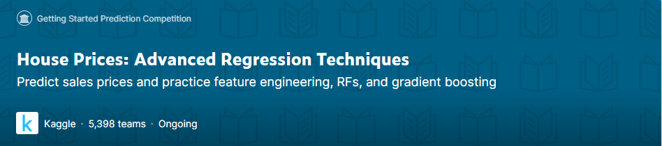
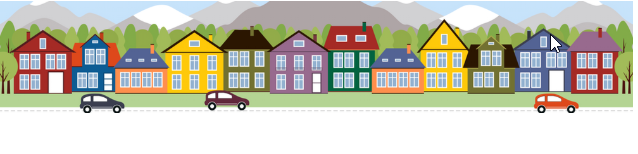

# House-Prices-Kaggle

## Autors

Damián Martínez Carmona

Eusebi Garcia Reina

## Descripció

Aquest dataset conté les característiques d'un conjunt de cases amb **79 variables** que descriuen gairebé completament cada aspecte d'aquestes cases residencials ubicades en Ames, Iowa. Aquest data set forma part d'un challenge en Kaggle anomenat:**"HousePrices: Advance Regression Techniques"** on el repte és **predir el preu final de cada casa**. 

En el dataset Hi ha 1460 observacions amb 81 atributs, on la variable a predir és contínua (SalePrice). Addicionalment a la predicció dels preus es pretén donar resposta a les següents preguntes:
* Predicció dels preus de venda (SalePrice) de les cases en funció de els seves característiques (creació d'un model de regressió lineal).
* Anàlisi per barris: diferència en el preu de venda en funció del barri on es troba la casa.
* Comparació dels preus de venda entre els anys 80 i els 90: hi ha diferències significatives entre els preus de venda en aquestes dues dècades?
* Anàlisi del preu de venda al llarg del temps: com evoluciona el preu de venda de les cases en funció de les variables temporals del dataset?

## Instal·lació i ús

El codi d'aquest script s'ha fet en **R**, usant **R Studio** per a la seva compilació. Les llibreries utilitzades es poden referenciar amb el comande library:

* library(readr)
* library(dplyr)
* library(tidyverse)
* library(class)
* library(purrr)
* library(cluster)
* library(ggplot2)
* library(arules)
* library(tseries)
* library(knitr)
* library(caret)
* library(moments)
* library(reshape2)
* library(ggfortify)
* library(viridis)
* library(discretization)
* library(fpc)
* library(nortest)
* library(DescTools)
* library(plotly)
* library(knitr)

En el cas d'haver d'instal·lar algun paquet a R, es pot executar en la consola (e.g. per instal·lar el paquest nortest:

if(!require(nortest)){ 
    install.packages('nortest', repos='http://cran.us.r-project.org')
    library(nortest)
}

## Contingut del Repositori

* **PRA2.Rmd:** Arxiu rmarkdown amb el codi en R de l'anàlisi i models realitzats, així com els comentaris, descripció i conclusions.
* **PRA2.html:** Arxiu HTML generat amb la funció knit de R Studio que convertix el fitxer rmarkdown en HTML
* **PRA2DamEus_Submission.csv:** Arxiu csv generat al aplicar el model de regressió lineal sobre el data source de test. Aquest fitxer s'entrega a l'apartat de Submissions del repte de Kaggle.
* **PRA2_Eusebio_Damian.pdf:** Memòria en PDF del que s'ha fet al script amb comentaris, descripció i conclusions.

Dintre de la carpeta **HousePrice Folder:** Hi ha els fitxers inicials obtinguts de Kaggle:
* **data_description.txt:** Archiu de metadades, conté la descripció de tots els atributs del dataset.
* **sample_submission.csv:** Arxiu d'exemple per a veure el format que ha de tenir el fitxer que enviem amb les prediccions: Els únics atributs que conté són Id i SalePrice..
* **test.csv:** dataset de test per a aplicar i testejar el model.
* **train.csv:** dataset de train per a entrenar el model.

## Dataset

La informació relativa al dataset _HousePrices_ es pot trobar al següent enllaç de Kaggle: https://www.kaggle.com/c/house-prices-advanced-regression-techniques/overview

